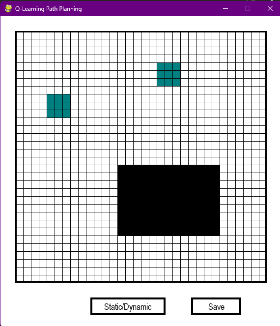
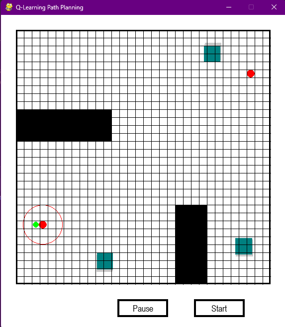
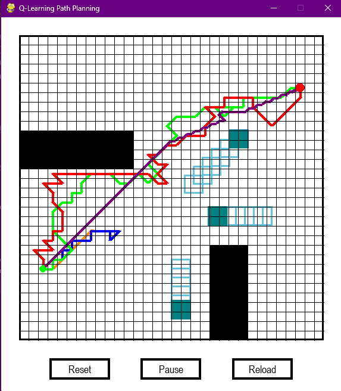

# Q-Learning for mobile robot in dynamic environments
This repository contains the code for the Q-Learning algorithm for a mobile robot in dynamic environments with moving obstacles. 

## Installation
To clone the repository, run the following command:
```bash
git clone https://github.com/nonameex1sts/Dynamic_Q-Learning.git
```

To install the required packages, run the following command:
```bash
pip install -r requirements.txt
```

Note: The code was tested with Python 3.10 in PyCharm on Windows 11.

## Create new map
To create a new map, run the following command:
```bash
python MapCreator.py
```

The interface will open, click `Static/Dynamic` to switch between static and dynamic obstacles then drag on the grid with left mouse
to create an obstacle. Static obstacles are black, dynamic obstacles are blue. Finally, click on the `Save` button to save the map.

<p align="center">
  
</p>

The obstacles will be saved in `MapData.py` as follows:
```
Obstacle(343.0, 375.0, 208, 144, True, [0, 0]),
Obstacle(342.5, 118.5, 47, 47, False, [1.7242331795219754, 0.3739710559659452]),
Obstacle(119.0, 182.5, 48, 47, False, [1.3243442711683744, -0.06282929333491694])
```

Edit the list of obstacles in `MapData.py` to create a new map: Add `Start` and `Goal` points, 
put obstacles in `Obstacles` list, then add the data to a scenario or create a new one. The structure of the data is as follows:
```
{
"Start": (70, 422),
"Goal": (502, 118),
"Obstacles": [
    Obstacle(343.0, 375.0, 208, 144, True, [0, 0]),
    Obstacle(342.5, 118.5, 47, 47, False, [1.7242331795219754, 0.3739710559659452]),
    Obstacle(119.0, 182.5, 48, 47, False, [1.3243442711683744, -0.06282929333491694])
]}
```

Note: The center of the top left corner square of the grid is (38, 38). Each square is 16x16 pixels and the grid is 32x32 squares.
x-axis is horizontal increasing from left to right, y-axis is vertical increasing from top to bottom.

## Run the code
To run the code, run the following command:
```bash
python Simulation.py
```

Then input in terminal as follows:
```
Enter version (1-ClassicalQL, 2-DFQL, 3-CombinedQL, 4-DualQL, 5-DWA):
Training? (y/n):
Enter scenario (uniform/diverse/complex):
Enter map (1/2/3):
Automatically run 20 times? (y/n):
```
Note: `Enter version` receives a number from 1 to 4 and if `Automatically run 20 times?` is `n`, the code will run only once.
Also, if version is 5 (DWA), the code automatically chooses `testing mode`.

The interface will open, click `Start` to run the code and `Pause` to pause/resume the simulation. 
If`Automatically run 20 times?` is `y`, the code will run 20 times automatically without having to click `Start`.

<p align="center">
  
</p>

## Results
After running the code in `training mode`, the policy and the reward of each episode will be saved in the `policy` folder.

After running the code in `testing mode` (not `training mode`), the results and path of each run will be saved in the `result` folder.

### Calculate metrics
To calculate the metrics of a map, run the following command:
```bash
python result/LengthAngleSafety.py
```

Then input in terminal as follows:
```
Enter scenario (uniform/diverse/complex):
Enter map (1/2/3):
Save to xlsx? (y/n): 
```

If `Save to xlsx?` is `y`, the metrics will be saved in an xlsx file in the `result/<scenario>/<map>/` folder.

The metrics include:
- `Success rate`: The percentage of runs that the robot reaches the goal.
- `Success length`: The average length of the path when the robot reaches the goal.
- `Success angle`: The average turning angle of the path when the robot reaches the goal.
- `Success safety`: The average safety of the path when the robot reaches the goal.

### Visualize the convergence
To visualize the convergence of the Q-Learning algorithm, run the following command:
```bash
python result/Convergence.py
```

Then input in terminal as follows:
```
Enter scenario (uniform/diverse/complex):
Enter map (1/2/3):
```

### Visualize the path
To visualize the path of a map, run the following command:
```bash
python result/PathVisualization.py
```

Then input in terminal as follows:
```
Enter scenario (uniform/diverse/complex):
Enter map (1/2/3):
```

The interface will open and choose the run of each algorithm randomly to visualize the path. 
Click `Reset` to reset the obstacles (only in Complex scenario), 
`Pause` to pause/resume the simulation, 
and `Reload` to randomly choose another run for each algorithm.
Use left/right arrow keys on keyboard to change the proportion of the path. 
For example, if the proportion is 0.5, the path will be shown from the start to the middle.

<p align="center">
  
</p>

The color of the path represents the algorithm as follows:
- `Dark orange`: Classical Q-Learning
- `Blue`: DFQL
- `Green`: Combined Q-Learning
- `Red`: Dual Q-Learning
- `Purple`: DWA